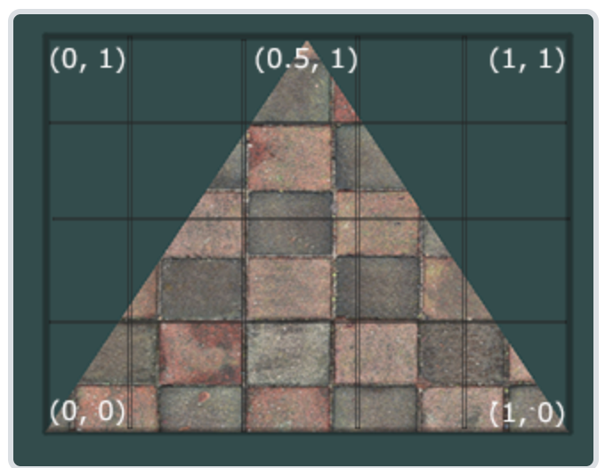

研究发现，是如图所示的纹理坐标的上下颠倒导致模型贴图加载错误。

在片元着色器1.model_loading.vs中修改代码如下，即可解决。



```
void main()
{
    TexCoords = aTexCoords;    
    gl_Position = projection * view * model * vec4(aPos, 1.0);
}

===

void main()
{
    TexCoords = vec2(0.0, 1.0) - aTexCoords;    
    gl_Position = projection * view * model * vec4(aPos, 1.0);
}

```


后来发现，仅通过手动调整并不会解决该问题。

查阅可知，aiProcess_FlipUVs将在处理的时候翻转y轴的纹理坐标（你可能还记得我们在纹理教程中说过，在OpenGL中大部分的图像的y轴都是反的，所以这个后期处理选项将会修复这个）

于是做如下修改：

```
    // before linton change: const aiScene* scene = importer.ReadFile(path, aiProcess_Triangulate | aiProcess_GenSmoothNormals | aiProcess_FlipUVs | aiProcess_CalcTangentSpace);
        const aiScene* scene = importer.ReadFile(path, aiProcess_Triangulate | aiProcess_GenSmoothNormals | aiProcess_CalcTangentSpace);
```

然后就解决了！
