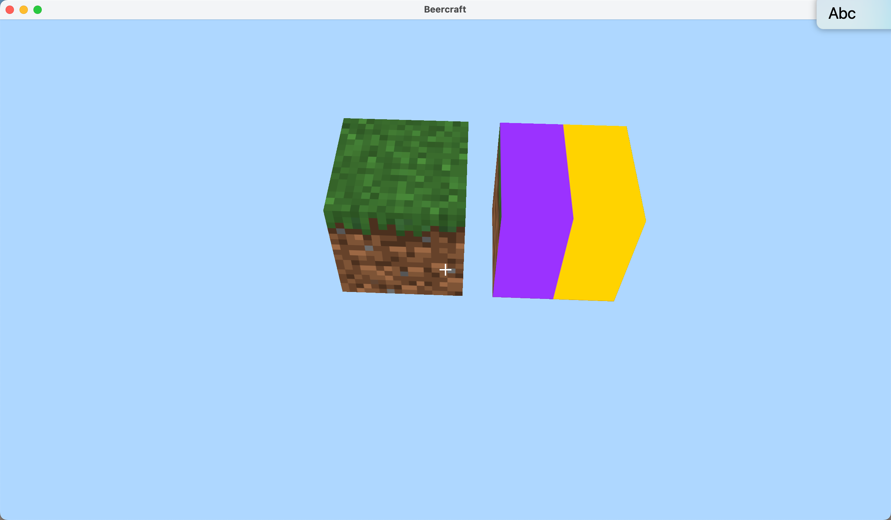

# 坐标建立结论

- 先translate，再scale是关键。（教程本来就是这么做的。）
- 取scale为全0.5，则现在一个方块的大小为1.0个坐标。由下图可以证明这一点：

- 因此，现在方块的大小正合适。因为上图中方块一个移动0.5个坐标单位，另一个位于原点，他们正好在二分之一处重合。
- 如果取scale为更小（例如全0.2），会导致如下：

- 因此，现在正合适。
- 结论：在当前实验中，由于先translate再scale，所以方块的中心永远都是正确的，例如平移到(0.5,0,0)，则然后再scale就是以(0.5,0,0)为中心原地放缩。
- 现在，我们找到了合适的scale值，从而使得方块的长度正好等于1.0个坐标单位，因此所有方块的中心都取整数即可实现方块之间的平滑铺开。

